# 1.8
**1.** (a) $<$, (b) $\leq$, (c) $\leq$ (d) $>$

**2.** -1, 2

| Interval                                               | ($-\infty$, -1) | (1,2)  | (2,$\infty$) |
| ------------------------------------------------------ | --------------- | ------ | ------------ |
| **Sign of $x + 1$** **Sign of $x - 2$**             | - -          | + - | + +       |
| **Sign of $\frac{x+1}{x-2}$** | +               | -      | +            |

Yes, ($-\infty$, -1) and (2, $\infty$), \[1, 2)

**3.** (a) \[-3, 3\] (b)($-\infty$, -3], \[3, $\infty$) 

**4.**(a) $\mid x \mid < 3$ (b) $\mid x \mid > 3$

**5.** 
(a) No, the solutions are ($-\infty$, -1) $\cup$ (0, $\infty$), x can be negative. 

| Interval     | ($-\infty$, -1) | (-1, 0) | (0, $\infty$) |
| ------------ | --------------- | ------- | ------------- |
| $x$ $x+1$ | - -          | - +  | + +        |
| $x(x+1)$     | +               | -       | +             |

(b) No, $x = 5$ satisfies the inequality $x(x + 1) > 5$, but does not satisfy x > 5. Therefore, if $x(x + 1) > 5$, it does not necessarily follow that $x > 5$.

**6.** (a) Divide by 3 (b) Add 2 (c) Rewrite as $-8 \leq 3x + 2 \leq 8$

**7.** $\bigg\lbrace \frac{5}{6}, 1, \sqrt{5}, 3, 5 \bigg\rbrace$

$$\begin{aligned}
   -2 + 3x \geq \frac{1}{3} \\
   3x \geq \frac{1}{3} + 2 \\
   3x \geq \frac{7}{3} \\
   x \geq \frac{7}{9}
   \end{aligned}
$$

**8.** $\bigg\lbrace -5, -1, 0\bigg\rbrace$

| $1 - 2x \geq 5x$     |                            |
| -------------------- | -------------------------- |
| $-7x \geq -1$        | Subtract $5x$ and $1$      |
| $x \leq \frac{1}{7}$ | Multiply by $-\frac{1}{7}$ |

**9.** $\bigg\lbrace 3, 5\bigg\rbrace$

| $1 < 2x - 4 \leq 7$                 |             |
| ----------------------------------- | ----------- |
| $5 < 2x \leq 11$                    | Add $4$     |
| $\frac{5}{2} < x \leq \frac{11}{2}$ | Divide by 2 |

**10.** $\bigg\lbrace\sqrt{5}, 3, 5, \bigg\rbrace$

| $-2 \leq 3-x < 2$ |                  |
| ----------------- | ---------------- |
| $-5 \leq -x < -1$ | Subtract $3$     |
| $5 \geq x > 1$    | Multiply by $-1$ |

**11.** $\bigg\lbrace-5, -1, \sqrt{5}, 3, 5\bigg\rbrace$

| $\frac{1}{x} \leq \frac{1}{2}$ |                  |
| ------------------------------ | ---------------- |
| $2 \leq x$                     | Multiply by $2x$ |

**12.** $\bigg\lbrace -1, 0, \frac{2}{3}, \frac{5}{6}, 1 \bigg\rbrace$

| $x^2 + 2 < 4$      |                                    |
| ------------------ | ---------------------------------- |
| $x^2 < 2$          | Subtract $2$                       |
| $x < \pm \sqrt{2}$ | Take the square root of both sides |
**13.** ($-\infty, \frac{7}{2}$\] 

| $2x \leq 7$          |               |
| -------------------- | ------------- |
| $x \leq \frac{7}{2}$ | Divide by $2$ |

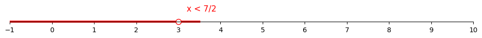

**14.** $(-\infty, -\frac{5}{2})$

| $-4x \geq 10$         |                |
| --------------------- | -------------- |
| $x \leq -\frac{5}{2}$ | Divide by $-4$ |

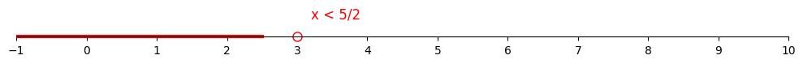

**15.** (4, $\infty$) 

| $2x - 5 > 3$ |               |
| ------------ | ------------- |
| $2x > 8$     | Add $5$       |
| $x > 4$      | Divide by $2$ |

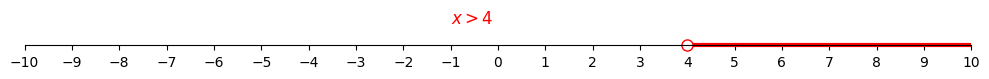

**16.** ($-\infty$, -2) 

| $3x + 11 < 5$ |               |
| ------------- | ------------- |
| $3x < -6$     | Subtract $11$ |
| $x < -2$      | Divide by $3$ |

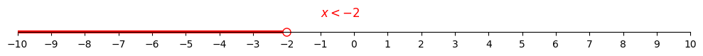

**17.** ($-\infty$, 2\]

| $7 - x \geq 5$ |               |
| -------------- | ------------- |
| $-x \geq -2$   | Subtract $7$  |
| $x \leq 2$     | Multiply $-1$ |

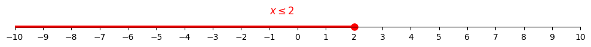

**18.** \[7, $\infty$) 

| $5 - 3x \leq -16$ |                |
| ----------------- | -------------- |
| $-3x \leq -21$    | Subtract $5$   |
| $x \geq 7$        | Divide by $-3$ |

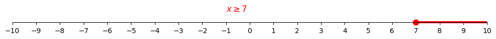

**19.** ($-\infty$, $-\frac{1}{2}$) 

| $2x + 1 < 0$       |               |
| ------------------ | ------------- |
| $2x < -1$          | Subtract $1$  |
| $x < -\frac{1}{2}$ | Divide by $2$ |

**20.** ($-\infty$, $\frac{5}{2}$)

| $0 < 5 - 2x$      |               |
| ----------------- | ------------- |
| $2x < 5$          | Add $2x$      |
| $x < \frac{5}{2}$ | Divide by $2$ |

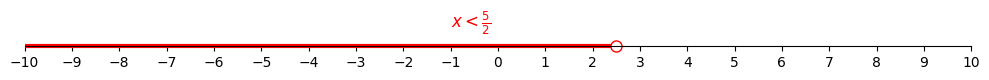

**21.** (-3, $\infty$)

| $4x - 7 < 8 + 9x$ |                        |
| ----------------- | ---------------------- |
| $-5x < 15$        | Subtract $9x$, add $7$ |
| $x > -3$          | Divide by $-5$         |

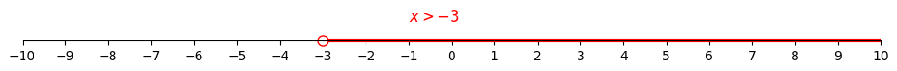

**22.** ($-\infty$, $-\frac{12}{11}$\]

| $5 - 3x \geq 8x -7$     |                    |
| ----------------------- | ------------------ |
| $-11x \geq -12$         | Subtract $8x$, $5$ |
| $x \leq -\frac{12}{11}$ | Divide by $-11$    |

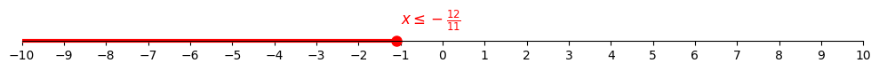

**23.** ($\frac{16}{3}$, $\infty$)

| $\frac{1}{2}x - \frac{2}{3} > 2$ |                   |
| -------------------------------- | ----------------- |
| $\frac{1}{2}x > \frac{8}{3}$     | Add $\frac{2}{3}$ |
| $x > \frac{16}{3}$               | Multiply by $2$   |

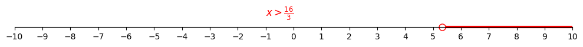

**24.** ($-\infty$, $-\frac{1}{3}$)

| $\frac{2}{5}x + 1 < \frac{1}{5} - 2x$ |                            |
| ------------------------------------- | -------------------------- |
| $\frac{12}{5}x < -\frac{4}{5}$        | Subtract $1$, add $2x$     |
| $x < -\frac{1}{3}$                    | Multiply by $\frac{5}{12}$ |

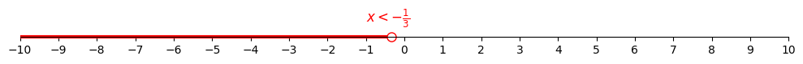

