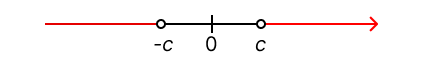

# Mathematics

## Fundamentals

### Complex Numbers

**DEFINITION OF COMPLEX NUMBERS**

A **complex** number is an expression of the form
$$a + bi$$
where $a$ and $b$ are real numbers and $i^2 = -1$. The **real part** of the complex number is a, and the **imaginary part** is $b$. Two complex numbers are equal if and only their real parts are equal and their imaginary parts are equal.

**ADDING, SUBTRACTING, AND MULTIPLYING COMPLEX NUMBERS**

| Definition                                                              | Description                                                                   |
| ----------------------------------------------------------------------- | ----------------------------------------------------------------------------- |
| **Addition**   $(a + bi) + (c + di) = (a + c) + (b+d)i$             | To add complex numbers, add the real parts and the imaginary parts.           |
| **Subtraction**   $(a + bi) - (c + di) = (a - c) + (b - d)i$        | To subtract complex numbers, subtract the real parts and the imaginary parts. |
| **Multiplication**   $(a + bi) * (c + di) = (ac - bd) + (ad + bc)i$ | Multiply complex numbers like binomials, using i^2 = -1.                      |
**DIVIDING COMPLEX NUMBERS**

To simplify the quotient $\frac{a + bi} {c + di}$, multiply the numerator and denominator by the complex conjugate of the denominator:
$$\frac{a + bi}{c + di} = \left(\frac{a + bi}{c + di}\right)\left(\frac{c - di}{c - di}\right) = \frac{(ac + bd)(bc-ad)i}{c^2 + d^2}$$

**SQUARE ROOTS OF NEGATIVE NUMBERS**

If $-r$ is negative, then the **principal square root** of $-r$ is
$$\sqrt{-r} = i\sqrt{r}$$
The two square roots of $-r$ are $i\sqrt{r}$ and $-i\sqrt{r}$.
###  Modeling with Equations

**GUIDELINES FOR MODELING WITH EQUATIONS**

1. **Identify the Variable.** Identify the quantity that problem asks you to find. This quantity can usually be determined by **a careful reading of the question** that is posed at the end of the problem. Then **introduce notation** for the variable (call it x or some other letter).
2. **Translate from Words to Algebra.** Read each sentence in the problem again, and express all the quantities mentioned in the problem in terms of the variable you defined in Sept 1. To organize this information, it is sometimes helpful to **draw a diagram** or **make a table**.
3. **Set Up the Model.** Find the crucial fact in the problem that gives a relationship between the expressions you listed in Step 2. **Set up an equation** (or **model**) that expresses this relationship.
4. **Solve the Equation and Check Your Answer.** Solve the equation, check your answer, and express it as a sentence that answers the question posed in the problem.

**Explain an Equation**

When an equation models a real-world situation, it means that the equation represents  a relationship between quantities in that situation. The equation uses mathematical symbols and variables to describe how those quantities are related. Solving the equation can help use understand or predict the behavior of the real-world system.

Example:

Let's say you're running a lemonade stand. You know that each glass of lemonade costs you $0.50 to make, and you sell each glass for $1.50. You want to figure out how many glasses of lemonade you need to sell to make a profit of $20.

You can model this situation with equation:

`Profit = (Selling price per glass - Cost per glass) * Number of glasses sold`

Substituting the values:

`$20 = ($1.50 - $0.50) * Number of glasses sold`

Solve for **the number of glasses sold** gives you the answer to your real-world problem.

Key points to emphasize:

- Equations are tools to represent and solve real-world problems.
- They can involve multiple variable.
- Solving an equation may not always directly give the final answer to the problem.
### Inequalities

**RULES FOR INEQUALITIES**

| Rule                                                                                     | Description                                                                                                                      |
| ---------------------------------------------------------------------------------------- | -------------------------------------------------------------------------------------------------------------------------------- |
| 1. $A \leq B \Leftrightarrow A + C \leq B + C$                                           | **Adding** the same quantity to each side of an inequality gives an equivalent inequality.                                       |
| 2. $A \leq B \Leftrightarrow A - C \leq B -C$                                            | **Subtracting** the same quantity from each side of an inequality gives an equivalent inequality.                                |
| 3. If $C > 0$, then $A \leq B \Leftrightarrow CA \leq CB$                                | **Multiplying** each side of an inequality by the same *positive* quantity gives an equivalent inequality.                       |
| 4. If $C < 0$, then $A \leq B \Leftrightarrow CA \geq CB$                                | **Multiplying** each side of an inequality by the same *negative* quantity *reverses the direction* of the inequality.           |
| 5. If $A > 0$, and $B > 0$, then $A \leq B \Leftrightarrow \frac{1}{A} \geq \frac{1}{B}$ | **Taking reciprocals** of each side of an inequality involving *positive* quantities *reverses the direction* of the inequality. |
| 6. If $A \leq B$ and $C \leq D$, then $A + C \leq B + D$                                 | Inequalities can be added.                                                                                                       |
| 7. If $A \leq B$ and $B \leq C$, then $A \leq C$                                         | Inequality is transitive.                                                                                                        |
**THE SIGN OF A PRODUCT OR QUOTIENT**
- If a product or a quotient has an *even* number of *negative* factors, then its value is *positive*.
- If a product or a quotient has an *odd* number of *negative* factors, then its value is *negative*.

**GUIDELINES FOR SOLVING NONLINEAR INEQUALITIES**
1. **Move All Terms to One Side.** If necessary, rewrite the inequality so that all nonzero terms appear on one side of the inequality sign. If the nonzero side of the inequality involves quotients, bring them to a common denominator.
2. **Factor.** Factor the nonzero side of the inequality.
3. **Find the Intervals.** Determine the values for which each factor is zero. These numbers will divide the real line into intervals. List the intervals that are determined by these numbers.
4. **Make a Table or Diagram.** Use **test values** to make a table or diagram of the signs of each factor on each interval. In the last row of the table determine the sign of the product (or quotient) of these factors.
5. **Solve.** Use the sign table to find the intervals on which the inequality is satisfied. Check whether the **endpoints** of these intervals satisfy the inequality. (This may happen if the inequality involves $\leq$ or $\geq$.)

**PROPERTIES OF ABSOLUTE VALUE INEQUALITIES**

| Inequality              | Equivalent form           | Graph                      |
| ----------------------- | ------------------------- | -------------------------- |
| 1. $\mid {x} \mid < c$  | $-c < x < c$              |  |
| 2. $\mid x \mid \leq c$ | $-c \leq x \leq c$        |  |
| 3. $\mid x \mid > c$    | $x < -c$ or $c < x$       |  |
| 4. $\mid x \mid \geq c$ | $x \leq -c$ or $c \leq x$ |  |
### The Coordinate Plane; Graphs of Equations; Circles

**DISTANCE FORMULA**

The distance between the points $A(x_1, y_1)$ and $B(x_2, y_2)$ in the plane is

$$
d(A, B) = \sqrt{(x_2 - x_1)^2 + (y_2 - y_1)^2}
$$

**MIDPOINT FORMULA**

The midpoint of the line segment from $A(x_1, y_1)$ to $B(x_2, y_2)$ is

$$
\bigg( \frac{(x_1 + x_2)}{2}, \frac{(y_1 + y_2)}{2} \bigg)
$$

**THE GRAPH OF AN EQUATION**

The **graph** of an equation in $x$ and $y$ is the set of all points $(x, y)$ in the coordinate plane that satisfy the equation.

**DEFINITION OF INTERCEPTS**

| Intercepts                                                                                                | How to find them          | Where they are on the graph |
| --------------------------------------------------------------------------------------------------------- | ------------------------- | --------------------------- |
| ***x*-intercepts:** The *x*-coordinates of points where the graph of an equation intersects the x-axis | Ser y = 0 and solve for x |   |
| ***y*-intercepts:** The *y*-coordinates of points where the graph of equation intersects the y-axis    | Set x = 0 and solve for y |   |

**EQUATION OF A CIRCLE**

An equation of the circle with center(*h, k*) and radius *r* is

$$
(x - h)^2 + (y - k)^2 = r^2
$$

This is called the **standard form** for the equation of the circle. If the center of the circle is the origin(0, 0), then the equation is

$$
x^2 + y^2 = r^2
$$

**TYPES OF SYMMETRY**

| Symmetry                       | Test                                                                                   | Graph                      | Property of Graph                                      |
| ------------------------------ | -------------------------------------------------------------------------------------- | -------------------------- | ------------------------------------------------------ |
| **With respect to the x-axis** | Replace y by -y. The resulting equation is equivalent to the original one.             |  | Graph is unchanged when reflected about the x-axis.    |
| **With respect to the y-axis** | Replace x by -x. The resulting equation is equivalent to the original one.             |  | Graph is unchanged when reflected about the y-axis     |
| **With respect to the origin** | Replace x by -x and y by -y. The resulting equation is equivalent to the original one. |  | Graph is unchanged when rotated 180° about the origin. |

### Lines

**SLOPE OF A LINE**

The **slope** *m* of a nonvertical line that passes through the points $A(x_1, y_1)$  and $B(x_2, y_2)$ is

$$
m = \frac{rise}{run} = \frac{y_2 - y_1}{x_2 - x_1}
$$

The slope of a vertical line is not defined.

**POINT-SLOPE FORM OF THE EQUATION OF A LINE**

An equation of the line that passes through the point $(x_1, y_1)$ and has slope m is

$$
y - y_1 = m(x - x_1)
$$

**SLOPE-INTERCEPT FORM OF THE EQUATION OF A LINE**

An equation of the line that has slope m and y-intercept b is

$$
y = mx + b
$$

**VERTICAL AND HORIZONTAL LINES**
- An equation of the vertical line through (a, b) is x = a.
- An equation of the horizontal line through (a, b) is y = b.

**GENERAL EQUATION OF A LINE**

The graph of every **linear equation**

$$
Ax + By + C = 0 \qquad \text{(A, B not both zero)}
$$

is a line. Conversely, every line is the graph of a linear equation.

**PARALLEL LINES**

Two nonvertical lines are parallel if and only if they have the same slope.

**PERPENDICULAR LINES**

Two lines with slopes $m_1$ and $m_2$ are perpendicular if and only if $m_1m_2 = -1$, that is, their slopes are negative reciprocals:

$$
m_2 = - \frac{1}{m_1}
$$

### Solving Equations and Inequalities Graphically

**SOLVING AN EQUATION**

## Modeling Tools

